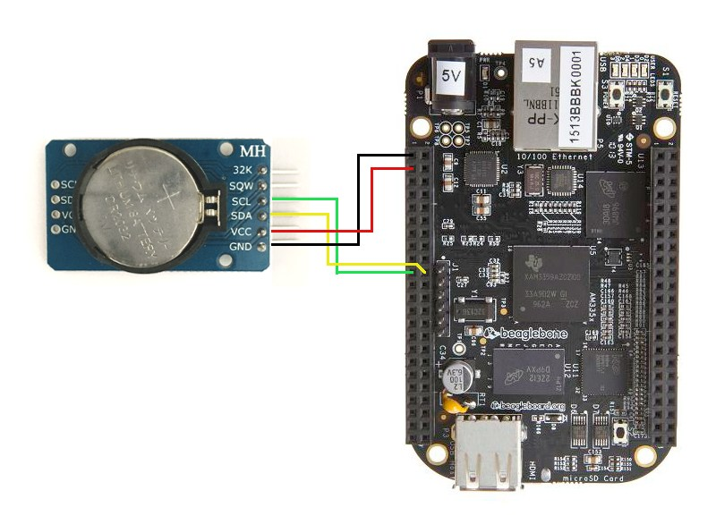

# RTC DS3231 practice (user space). I2C and device tree basics.

## Overview

DS3231 module that is recommended for this task contains two I2C devices:

* DS3231 RTC clock ([datasheet](https://datasheets.maximintegrated.com/en/ds/DS3231.pdf))
* AT24C32 32 kbit (4Kb) I2C EEPROM ([datasheet](https://ww1.microchip.com/downloads/en/DeviceDoc/doc0336.pdf))

DS3231 has a fixed I2C address 0x68.

AT24C32 can be assigned to any address in range 0x50..0x57 using solderable jumpers. By default, it has address 0x57. This address is already added to BBB device tree and used for cape configuration.

BBB has several I2C buses. I2C0 is intended to internal use. I2C1 and I2C2 are routed to P9 connector (see [Beagleboard:Cape Expansion Headers](https://elinux.org/Beagleboard:Cape_Expansion_Headers)).

In this homework we will use RTC board connected to I2C2 bus:

| RTC board line | BBB P9 pin |
| -------------- | ---------- |
| GND  | 1 (DGND)   |
| VCC  | 3 (VDD\_3V3) |
| SDA  | 20 (I2C2\_SDA) |
| SCL  | 19 (I2C2\_SCL) |



:exclamation: BBB configuration EEPROM is placed on I2C0 bus. Beware of changing its contents!

---

## Homework

* Connect the board as shown above. Do this when the board is turned off.

### RTC
* Download DS3231 datasheet for reference. 
* Using i2ctools (i2cdetect, i2cdump, etc.) read and write date/time registers 00h-06h, start and stop clock using EOSC bit in register 0Eh.
* Add the DS3231 chip as a real-time clock to the kernel:
  * Read about device binding (Documentation/devicetree/bindings/common-properties.txt, Documentation/devicetree/bindings/rtc/rtc-ds1307.txt)
  * Modify am335x-boneblack.dts to add DS3231 as rtc0. Use only required properties (no interrupts, ...).
  * Rebuild  am335x-boneblack.dtb file and copy it to network boot directories (do not forget about `/srv/tftp` directory). Reboot BBB.
  * Find rtc-related messages in dmesg
  * Find ds3231-related files in sysfs
  * Use date command to set date/time, off the board for a while and boot it again, check system
* Attach the format-patch of your changes in kernel (am335x-boneblack.dts)

### EEPROM

As it is noted above, the EEPROM is already added to the BeagleBone device tree. But in the device this EEPROM is set to AT24C256 type of size 32Kb (see arch/arm/boot/am335x-bone-common.dtsi, cape\_eeprom3). 
```
	compatible = "atmel,24c256";
```
So that, if we read the EEPROM device file we will get 32 KB of data.

* Use `find /sys/firmware/devicetree/ | grep cape_eeprom3` to get cape\_eeprom3 placement.
* Use `cat /the/directory/you/found/compatible` to check device type.
* Write some bytes to EEPROM (use `echo` to `/sys/bus/i2c/devices/2-0057/eeprom`)
* Read the whole EEPROM using `cat` from EEPROM device file (pipe `cat` output to `hexdump -C`). As you can see, your input is duplicated four times.
* Override am335x-bone-common.dtsi cape\_eeprom3 `compatible` property in am335x-boneblack.dts
(attach the format-patch of your changes in kernel)
* Rebuild  .dtb file and copy it to network boot directories.
* Use `cat /the/directory/you/found/compatible` to check if type is actually changed.
* Read the whole EEPROM device file again and compare results.

Note:
You can access EEPROM file in different ways because of symlinks in the hierarchy

* `/sys/bus/i2c/devices/2-0057/eeprom`
* `/sys/devices/platform/ocp/4819c000.i2c/i2c-2/2-0057/eeprom`
* `/sys/class/i2c-dev/i2c-2/device/2-0057/eeprom`
* `/sys/devices/platform/ocp/4819c000.i2c/i2c-2/device/i2c-2/2-0057/eeprom`

Also, `/proc/device-tree` now is a symlink to `/sys/firmware/devicetree/base`

## Literature

* [I2C short overview](https://www.ti.com/lit/an/slva704/slva704.pdf)
* [I2C specification](https://www.nxp.com/docs/en/user-guide/UM10204.pdf)
* [BBB SRM](https://github.com/beagleboard/beaglebone-black/blob/master/BBB_SRM.pdf)
* [BBB schematic file](https://github.com/beagleboard/beaglebone-black/blob/master/BBB_SCH.pdf)
* [Beagleboard:Cape Expansion Headers](https://elinux.org/Beagleboard:Cape_Expansion_Headers)

